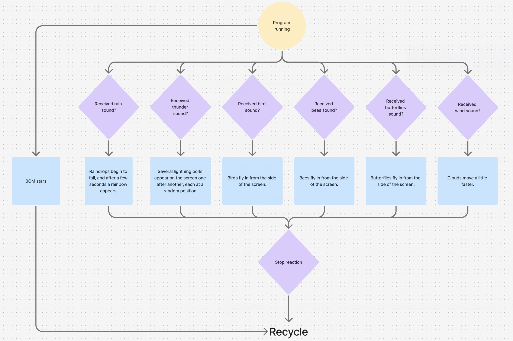
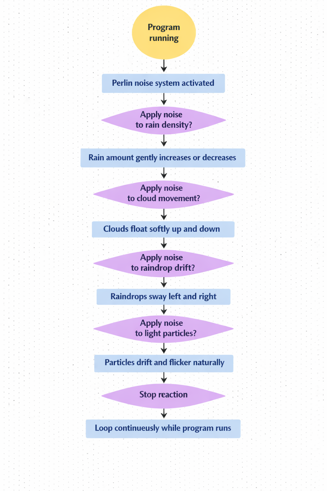
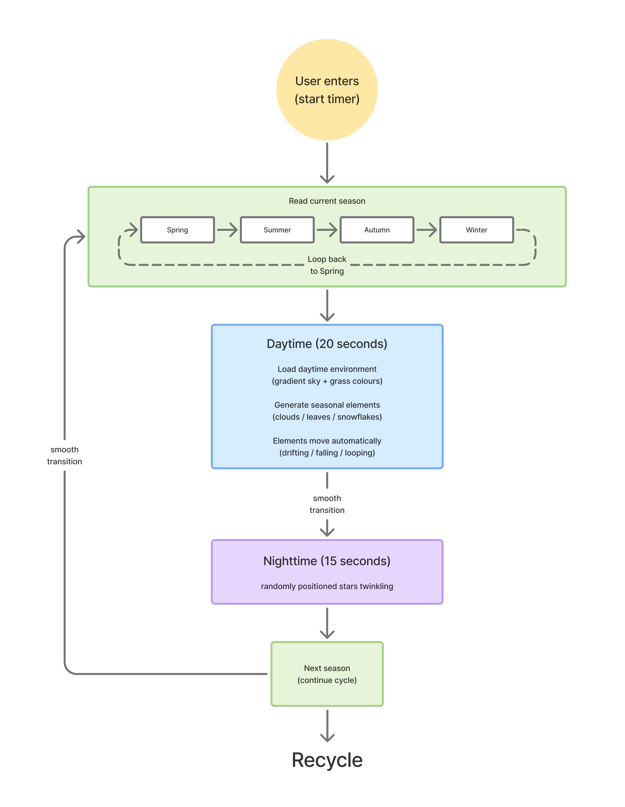
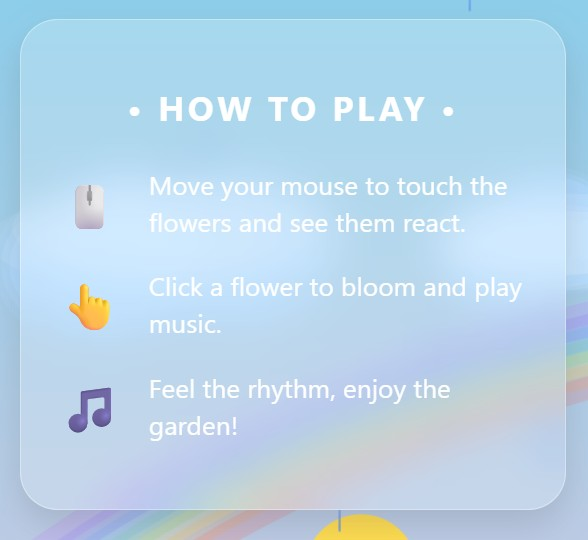

# Whispering Garden

## Part 1: Project Inspiration
We chose to create an original interactive artwork that presents a living seasonal garden. Our vision is to build an environment where flowers, weather, sound, and user actions all shape the atmosphere together. We were inspired by generative nature artworks, seasonal landscape animations, and interactive installations that blend sound with visual changes. These references encouraged us to explore how time‑based transitions, audio‑reactive effects, and playful user interactions can create an immersive digital ecosystem. Our piece will show flowers growing, fading, and responding to rain, thunder, and user input, forming a poetic world where nature constantly evolves.

*Reference pictures：*

## Part 2: Techniques
As shown in the image, all mechanisms work collaboratively on a shared P5 canvas, continuously updating the same interactive garden. They influence each other: user input affects flower movement, blooming, captions, and sound responses, while a time-based system controls the changing seasons and day/night cycles, and audio interactions such as rain and thunder further alter the atmosphere through visuals and sound effects. These mechanisms interact through shared environmental states, flower movement, and music. Conceptually, the project unifies these different mechanisms by depicting a vibrant, responsive ecosystem.

*Final Flowchart*

*To view our concept draft and details*
[Figma Link](https://www.figma.com/board/7YscZReD8ZMiSiOXHKcFZZ/9103coding?node-id=0-1&t=Xe31afqVZfyMg526-1)

## Part 3: Mechanics ownership

### Yifan Guo(Audio and Berlin noise):
This project combines audio‑reactive interaction with Perlin noise‑based visual effects to create a soft, natural atmosphere.
When different sounds are detected — such as rain, thunder, birds, or wind — the program triggers corresponding visual reactions.
The Berlin Noise module continuously adds subtle randomness to these effects, making rain density, cloud movement, and light particles vary smoothly over time.
Together, the audio and noise systems form a dynamic loop where sound drives nature, and noise keeps it alive.

*User flow draft for Audio*

*User flow draft for Berlin noise*

### Fangrong Cao(User input)
I plan to develop a user interaction system that integrates mouse operation, keyboard control, and dynamic subtitle technology to create an immersive seasonal musical garden. Animated subtitles will guide users to interact with the environment; for example, clicking on a flower will trigger its blooming and play music, while mouse movement will affect surrounding plants, causing them to move. Keyboard input will control the garden's transitions between the four seasons. These interactive mechanisms, through simple and easy-to-understand methods, help users experience the fun of this artwork, aligning with the project's vision. This flexible and responsive interactive approach fully reflects the project's focused pursuit of dynamic experiences, environmental evolution, and immersive digital art.

*User flow draft for user input*

### Xinran Nie(Time-based)
I plan to design an environment system based on time, which automatically cycles through the four seasons. Each season will feature different gradient sky and grass colours, along with dynamic environmental elements such as drifting clouds, falling leaves, and snowflakes. During the night phase, randomly positioned stars will twinkle to create a calmer and more atmospheric environment.
The time system begins running as soon as the user enters the experience. The environment then changes automatically over time through seasonal transitions and day–night cycles. Although users cannot directly control this mechanic, they interact with it by continuously experiencing the evolving atmosphere and visual changes within the scene.
During the daytime phase, the scenes of spring, summer, autumn, and winter will play sequentially in a loop. The changing day–night cycle will also gradually affect the lighting and colour palette of the environment. The daytime phase lasts approximately 20 seconds, while the nighttime phase lasts approximately 15 seconds. All transitions are designed to be smooth and gradual rather than sudden.
This mechanic supports the overall vision of the project by creating a serene and immersive environment. Through seasonal transitions, colour variation, and dynamic environmental movement, the system visually represents the passage of time and encourages users to experience the environment in a calm and reflective way.

*Time-based Mechanic Flowchart*

# AI acknowledgement
We acknowledged that we used AItool Gemini, Chatgpt and Codex to improve final effect and foster more harmonious cooperation between various mechanisms.We used generative AI tools like ChatGPT and Microsoft Copilot to polish our wording and improve clarity of expression.

# Interaction instructions
As described in the interface, users first enter a garden where they see flowers sprouting from the ground; they can move their mouse to sway the flowers or click on them to make them bloom, while the surrounding season and weather shift automatically over time.

