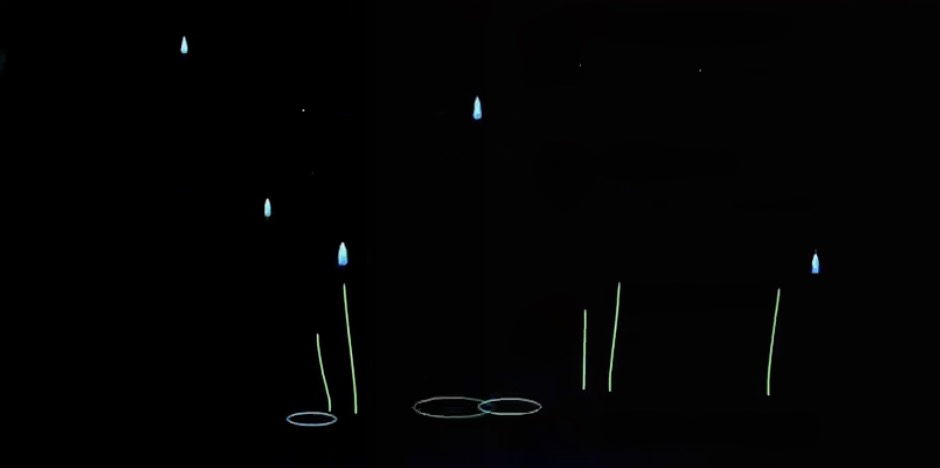
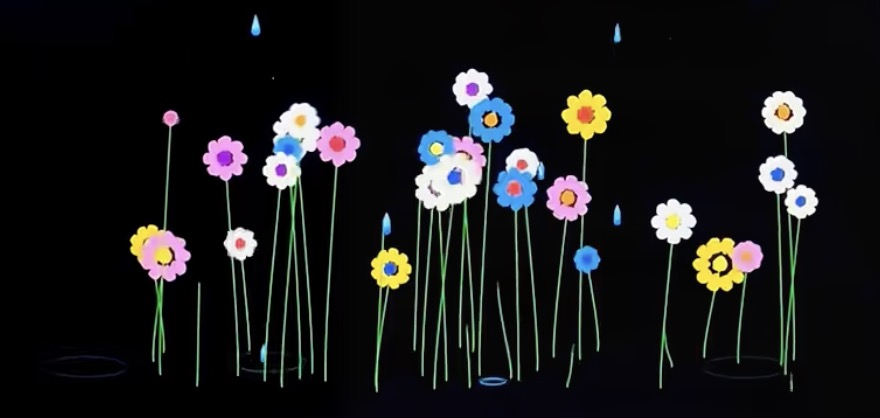
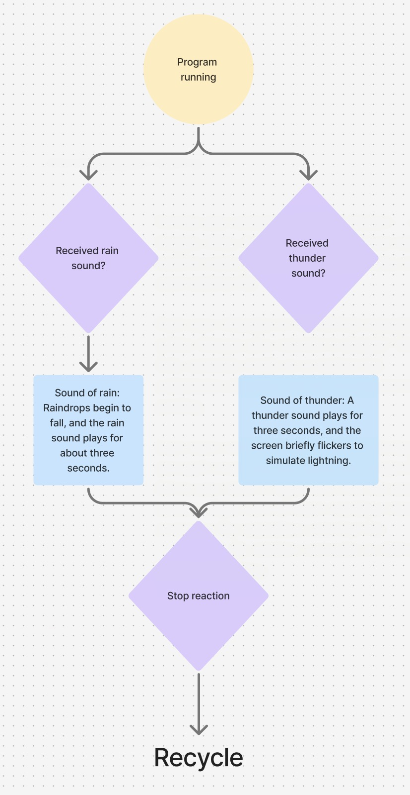
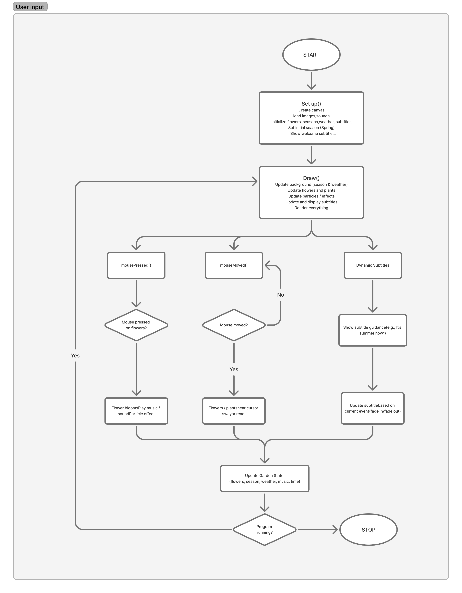

# 9103Finalwork

**Part 1: Project Direction**

We chose to create an original interactive artwork that presents a living seasonal garden. Our vision is to build an environment where flowers, weather, sound, and user actions all shape the atmosphere together. We were inspired by generative nature artworks, seasonal landscape animations, and interactive installations that blend sound with visual changes. These references encouraged us to explore how time‑based transitions, audio‑reactive effects, and playful user interactions can create an immersive digital ecosystem. Our piece will show flowers growing, fading, and responding to rain, thunder, and user input, forming a poetic world where nature constantly evolves.

*Reference pictures：*

## Part 2: Mechanics

### Yifan Guo(Audio):
I’m planning to explore the audio mechanic, even though we haven’t fully learned it yet. My idea is to use thunder or rain sounds and let the audio levels influence the visuals. For example, loud thunder could trigger bright flashes or stronger wind‑like movement in the flowers, while softer rain sounds could control the intensity of raindrops or ripples. This mechanic would make the weather feel more dramatic and immersive, because the visuals and sound would react to each other. Even if I start with something simple, connecting audio to the environment will help reinforce the mood of the piece and make the stormy scenes feel more realistic.

*User flow draft for Audio*

### Fangrong Cao(User input)
I plan to develop a user interaction system that integrates mouse operation, keyboard control, and dynamic subtitle technology to create an immersive seasonal musical garden. Animated subtitles will guide users to interact with the environment; for example, clicking on a flower will trigger its blooming and play music, while mouse movement will affect surrounding plants, causing them to move. Keyboard input will control the garden's transitions between the four seasons. These interactive mechanisms, through simple and easy-to-understand methods, help users experience the fun of this artwork, aligning with the project's vision. This flexible and responsive interactive approach fully reflects the project's focused pursuit of dynamic experiences, environmental evolution, and immersive digital art.

*User flow draft for user input*

### Xinran Nie(Time-based)
I plan to design an environment system based on time, which automatically cycles through the four seasons. Each season will feature different gradient sky and grass colours, along with dynamic environmental elements such as drifting clouds, falling leaves, and snowflakes. During the night phase, randomly positioned stars will twinkle to create a calmer and more atmospheric environment.
The time system begins running as soon as the user enters the experience. The environment then changes automatically over time through seasonal transitions and day–night cycles. Although users cannot directly control this mechanic, they interact with it by continuously experiencing the evolving atmosphere and visual changes within the scene.
During the daytime phase, the scenes of spring, summer, autumn, and winter will play sequentially in a loop. The changing day–night cycle will also gradually affect the lighting and colour palette of the environment. The daytime phase lasts approximately 20 seconds, while the nighttime phase lasts approximately 15 seconds. All transitions are designed to be smooth and gradual rather than sudden.
This mechanic supports the overall vision of the project by creating a serene and immersive environment. Through seasonal transitions, colour variation, and dynamic environmental movement, the system visually represents the passage of time and encourages users to experience the environment in a calm and reflective way.

*Time-based Mechanic Flowchart*

